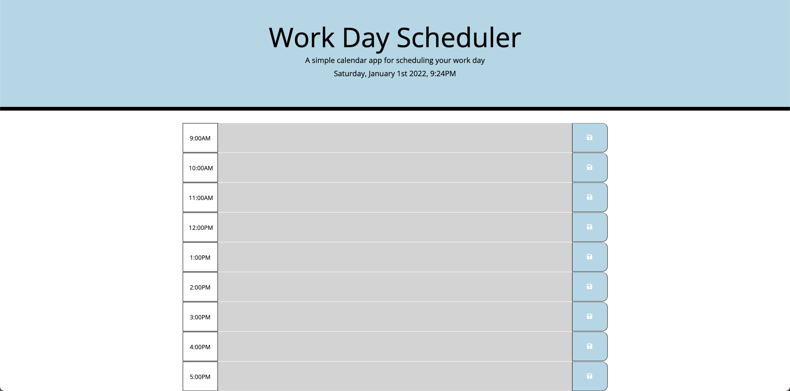

# Workday-Scheduler

### The object is to create a daily planner that you will be able to add events to manage my time more effetively. 
# 
# Planner Guidelines/ How to use:

### Enter your task in a time slot. As the day goes on, the color of each hour block changes according to it's relation to the "past, current, future". Past time (time that's already passed in the day) becomes grayed out and uneditable. Current time (time within the hour block) turns red for a warning that your task time is coming due. Future time (time that's coming up) is green.
#
# Screenshot

# Planner Link
https://iimkenny.github.io/Workday-Scheduler/

# Repository Link
https://github.com/iiMKenny/Workday-Scheduler